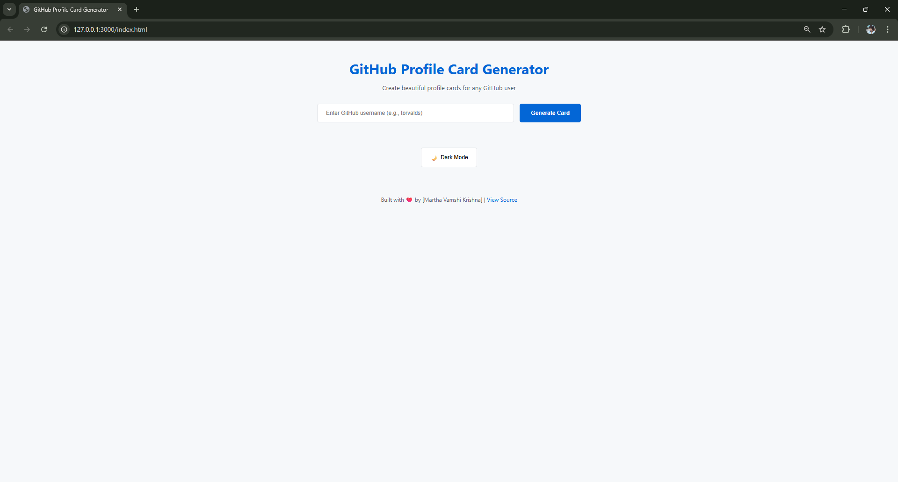
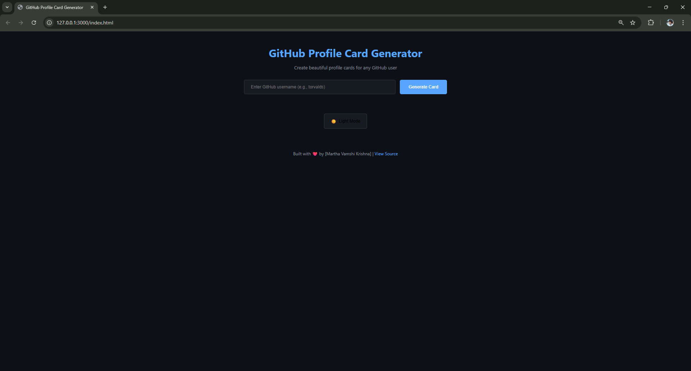
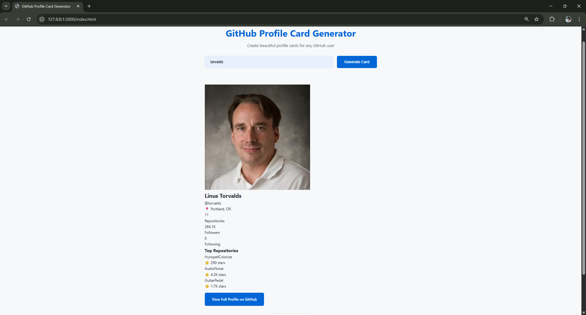
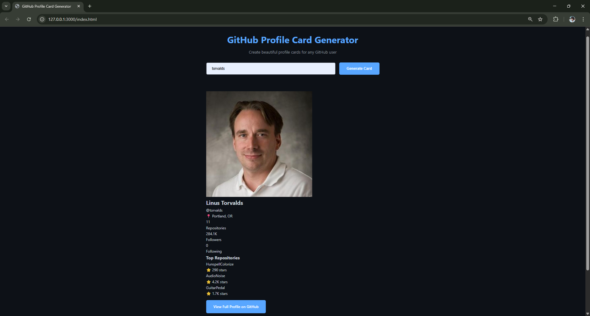

# 🎯 GitHub Profile Card Generator

A beautiful, responsive web application that generates elegant profile cards for any GitHub user. Built with vanilla JavaScript, HTML, and CSS - no frameworks needed!



## ✨ Features

- 🔍 **Real-time GitHub API Integration** - Fetches live user data
- 🎨 **Dark/Light Theme** - Toggle between themes with preference saving
- 📱 **Fully Responsive** - Works perfectly on mobile, tablet, and desktop
- ⚡ **Fast & Lightweight** - No frameworks, pure vanilla JavaScript
- 🛡️ **Error Handling** - Graceful error messages for invalid users
- ⌨️ **Keyboard Shortcuts** - Ctrl+K to focus search, Enter to submit
- 💾 **Recent Searches** - Saves your last 5 searches locally
- 🎭 **Smooth Animations** - Loading states and fade-in effects
- 🔒 **Input Validation** - Prevents invalid API calls

## 🚀 Live Demo

**[View Live Demo](https://mvkrishna24.github.io/github-profile-card-generator/)**


## 📸 Screenshots

## 📸 Screenshots

### Light Theme


### Dark Theme


### Light Profile View


### Dark Profile View


## 🛠️ Built With

- **HTML5** - Semantic markup
- **CSS3** - Modern styling with CSS Variables, Grid, Flexbox
- **Vanilla JavaScript (ES6+)** - Async/await, Fetch API, Modules
- **GitHub REST API** - User and repository data

## 🎯 What I Learned

Building this project taught me:

- ✅ **API Integration** - Working with RESTful APIs using `fetch()`
- ✅ **Async JavaScript** - Promises, async/await, error handling
- ✅ **DOM Manipulation** - Dynamic content rendering
- ✅ **ES6 Modules** - Code organization with import/export
- ✅ **LocalStorage** - Persisting user preferences
- ✅ **Responsive Design** - Mobile-first CSS approach
- ✅ **Error Handling** - Try/catch, HTTP status codes
- ✅ **UX Design** - Loading states, keyboard navigation
- ✅ **Git Workflow** - Version control best practices

## 🚦 Getting Started

### Prerequisites

- A modern web browser (Chrome, Firefox, Safari, Edge)
- Internet connection (for GitHub API calls)

### Installation

1. **Clone the repository**
```bash
   git clone https://github.com/mvkrishna24/github-profile-card-generator.git

```

2. **Navigate to project directory**
```bash
   cd github-profile-card-generator
```

3. **Open in browser**
   - Simply open `index.html` in your browser
   - Or use Live Server extension in VS Code

**That's it!** No build process, no npm install, just open and use.

## 📖 How to Use

1. **Enter a GitHub username** (e.g., `torvalds`, `mvkrishna24`, `tj`)
2. **Click "Generate Card"** or press Enter
3. **View the profile card** with avatar, stats, and top repositories
4. **Toggle dark mode** for comfortable viewing
5. **Click "View Full Profile"** to visit the GitHub profile

### Keyboard Shortcuts

- `Ctrl + K` / `Cmd + K` - Focus search input
- `Enter` - Generate card
- `Escape` - Clear input

## 🏗️ Project Structure
```
github-profile-card-generator/
│
├── index.html              # Main HTML file
├── css/
│   └── style.css          # All styles (variables, responsive)
├── js/
│   ├── api.js             # GitHub API functions
│   ├── ui.js              # DOM manipulation
│   └── app.js             # Main application logic
├── assets/
│   ├── screenshot-light.png
│   └── screenshot-dark.png
└── README.md              # You are here!
```

## 🔧 Code Highlights

### API Integration
```javascript
export async function fetchCompleteUserData(username) {
    const [profile, repos] = await Promise.all([
        fetchUserProfile(username),
        fetchUserRepos(username)
    ]);
    return { profile, repos };
}
```

### Dynamic UI Rendering
```javascript
export function renderProfileCard(data) {
    const { profile, repos } = data;
    profileCard.innerHTML = `
        <div class="profile-header">
            
            <h2>${profile.name || profile.login}</h2>
        </div>
        // ... more dynamic content
    `;
}
```

### Theme Toggle with LocalStorage
```javascript
export function toggleTheme() {
    const newTheme = currentTheme === 'dark' ? 'light' : 'dark';
    document.documentElement.setAttribute('data-theme', newTheme);
    localStorage.setItem('theme', newTheme);
}
```

## 🎨 Features Deep Dive

### Error Handling
- **404 Error** - "User not found. Please check the username."
- **403 Error** - "API rate limit exceeded. Try again later."
- **Network Error** - "Network error. Check your connection."
- **Invalid Input** - "Please enter a GitHub username."

### Responsive Design
- Mobile-first approach
- Flexbox and Grid layouts
- Breakpoint at 768px
- Touch-friendly buttons

### Performance
- Parallel API requests with `Promise.all()`
- Debounced input validation
- Minimal DOM manipulations
- CSS animations for smooth UX

## 🌐 Browser Support

- ✅ Chrome (latest)
- ✅ Firefox (latest)
- ✅ Safari (latest)
- ✅ Edge (latest)
- ✅ Mobile browsers (iOS Safari, Chrome Mobile)

## 📊 API Rate Limits

GitHub API allows:
- **60 requests/hour** for unauthenticated requests
- This is more than enough for normal usage
- Rate limit resets every hour

## 🐛 Known Issues

- None currently! 🎉

## 🔮 Future Enhancements

Ideas for future versions:
- [ ] Compare two GitHub profiles side-by-side
- [ ] Export card as PNG image
- [ ] Display contribution graph
- [ ] Show language statistics
- [ ] Add copy-to-clipboard for card HTML
- [ ] Display recent activity timeline
- [ ] Add share to Twitter functionality

## 🤝 Contributing

Contributions are welcome! Feel free to:
- Report bugs
- Suggest new features
- Submit pull requests

## 📄 License

This project is open source and available under the [MIT License](LICENSE).

## 👨‍💻 Author

**[Martha Vamshi Krishna]**

- GitHub: [@mvkrishna24](https://github.com/mvkrishna24)
- LinkedIn: [Krishna M](https://www.linkedin.com/in/krishna-m-226250366/)

## 🙏 Acknowledgments

- GitHub REST API for providing user data
- Inspired by GitHub's clean design aesthetic
- Built as part of my frontend learning journey

## 📬 Contact

Have questions or feedback? Feel free to reach out!

- Email: marthavamshikrishna1024@gamil.com


⭐ **If you found this project helpful, please give it a star!** ⭐

           Made with ❤️ with Git and JavaScript